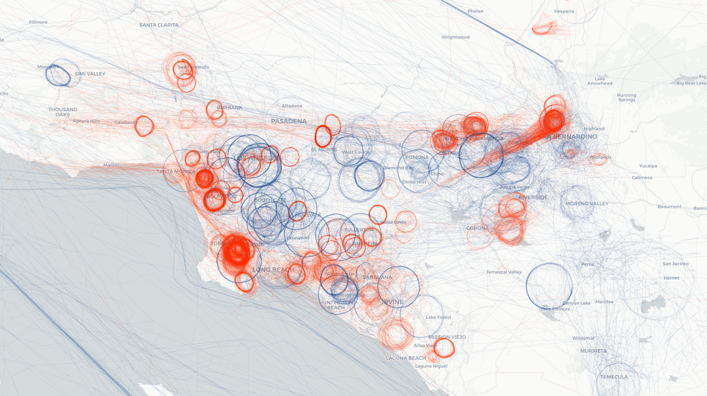
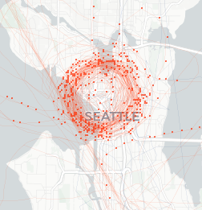

# [**BuzzFeed News: Spies in the Sky**](https://www.buzzfeednews.com/article/peteraldhous/spies-in-the-skies#.djN0KpK6m)
### An analysis of government surveillance planes being flown over the United States.
##### By Connor Hynes
----
### **Project Goal**

Buzzfeed News writers Peter Aldhous and Charles Seife, in 2016, built a machine
learning algorithm which could be used to detect which planes flying around the
United States were used by the FBI and the Department of Homeland Security for
surveillance. Many of the planes being flown by these government organizations
were equipped with cameras, cell phone trackers, and a described “augmented
reality software” which could be used to display information about the
surrounding areas to the pilots. The planes being flown are small, lightweight
aircrafts, usually of the Cessna model, that are equipped with mufflers with the
intention of silencing the sound they produce. Other aircrafts include
helicopters, with the Associated Press having found that many of these planes
were registered under companies that did not exist which were used by the FBI to
disguise their purpose. When contacted by Buzzfeed, the FBI and DHS denied that
these flights were for any other purposes other than “to follow terrorists,
spies, and serious criminals”, a statement that is questioned by the fact that
the amount of time spent flying these aircrafts decreased by over 70% during the
weekends and federal holidays, to which the ACLU concludes, “’. . . suggests
these (flights) are relatively run-of-the-mill investigations’”. This leads us
to the question, and main purpose of this analysis: To uncover why the United
States government is flying so many surveillance aircrafts around major cities.
To briefly discuss this purpose, the authors uncovered a few interesting pieces
of evidence. The first was related to the [2015 San Bernardino Mosque attack](https://en.wikipedia.org/wiki/2015_San_Bernardino_attack). Leading up to this
attack, no surveillance was reported in the San Bernardino area. However, one
day later, FBI planes were circling the mosque that one of the perpetrators
attended. This surveillance went on for a week, only halting on the weekends,
with the FBI stating that they do not track certain groups of people based on
race or religion, but only suspected terrorists. Another instance of this came
from the 2015 riots that followed the [killing of Freddie Gray in police custody
in Baltimore](https://en.wikipedia.org/wiki/Death_of_Freddie_Gray). This
surveillance also occurred in 2014 in Ferguson, Missouri, after a [police officer
shot Michael Brown](https://en.wikipedia.org/wiki/Shooting_of_Michael_Brown).
From these examples, the intentions of the authors begin to become clear. It is
crucial to keep track of this data so we can call into question why the FBI and
DHS are surveilling their citizens, and if their flights are being used to track
certain groups of people more than others.

The authors, [Peter Aldhous](https://www.buzzfeednews.com/author/peteraldhous) and [Charles Seife](https://www.buzzfeednews.com/author/cgseife) both contributed to this project.
Aldhous is a Science Reported for BuzzFeed News based in San Francisco. Seife is
a Journalist, author, and professor of Journalism at New York University. This
article seems to be written to be accessible to everyone. It of course is
targeting those who are concerned with the amount of surveillance the United
States government is doing, but it is written in a way which allows anyone to
become familiar with the concepts and understand what is happening.

---
### **The Map**

To begin, the map that the authors have constructed is based off leaflet, a
JavaScript library that we have become familiar with. It is also using CARTO and
CartoDB for spatial analysis and hosting of the map data. I am unfamiliar with
CARTO, but I would assume this is what is being used to construct the polygons
that we see on the map, used to represent the flying path of aircrafts, in real
time. This could be incorrect, but it is my conclusion, as there is no official
information on how they did this available. The map features two different
colors of lines. The red lines represent flight data from the FBI while the blue
lines represent flight data from the DHS. The authors did not include a legend
on the map, instead the added a PNG of their own legend below each map on the
webpage. Below is a screen shot of one map location, centered over Los Angeles,
CA.

Here you can see the major function of the map, plotting location data that is
placed using latitude and longitude, along with timestamps of when each location
point occurred.

    for (file in files) {
        tmp <- read_csv(paste0("data/feds/",file), col_types = list(
          adshex = col_character(),
          flight_id = col_character(),
          latitude = col_double(),
          longitude = col_double(),
          altitude = col_integer(),
          speed = col_integer(),
          squawk = col_character(),
          type = col_character(),
          timestamp = col_datetime(),
          name = col_character(),
          other_names1 = col_character(),
          other_names2 = col_character(),
          n_number = col_character(),
          serial_number = col_character(),
          mfr_mdl_code = col_character(),
          mfr = col_character(),
          model = col_character(),
          year_mfr = col_integer(),
          type_aircraft = col_integer(),
          agency = col_character()
        ))
        feds <- bind_rows(feds,tmp)
    }

This beefy chunk of code comes from their own [documentation](https://buzzfeednews.github.io/2016-04-federal-surveillance-planes/analysis.html),
showing how the read the CSV files the constructed. You can see all the
different variables they used, including the latitude, longitude, and timestamp
data mentioned above. I would also like to include a familiar code chunk, one
that initializes the map, sets zoom levels, and centers the viewport:

    var map = new L.Map('map', {
          center: [33.8,-118],
          zoom: 10,
          zoomControl: false,
          scrollWheelZoom: false
    });

The only interactive feature the map, but truly the most important, is a
interactive bar which changes the data that is highlighted based on the date.
This means that if you select the data shown below, the flight data on the map
for that day will be highlighted and change from solid lines to the original
points that are featured in the dataset.

Below is an example of what selected data looks like in Seattle, WA. You can see
how the lines now differ from previous or future day data points.

The map has other basic features such as letting you drag the viewport around as
well as letting you zoom by double-clicking.

---
### **Systematic Architecture**

This map utilizes one primary services to construct itself and then actively
change its elements based on what the user is viewing, as well as update data
points based on the timeframe that is set. The service [CARTO](https://carto.com/) is used for this, which is constantly being set GET
requests to update the map. The image below shows just a fraction of the
requests that are sent from the client to CARTO:

The map also sends data when the date slider is updated, requesting updated data
on what should be highlighted on the map. There is also a piece of code that I
found which uses jQuery to add responsive design. This piece resets zoom levels
for difference sizes of screens, giving users on different sized devices good
experiences.

         function responsive() {
			 width = $(window).width();
			 height = $(window).height();
			if (width < 500) {
				// set the zoom level to one less
				map.setZoom(9);
			} else {
				map.setZoom(10);
			}
		 }

The map also uses CartoDB to store all its data. CartoDB is a database service
that is used to hold the data library that the authors constructed. This library
of CSV files can then be queried by the service to get whatever information is
needed. This is essential in creating an online map when you have large amounts
of data as it allows you to store a separate version of the data you are using
for third parties to access. This means that the integrity of your original
database remains as it cannot be accessed by people visiting your map.

---
### **UI/UX and Map Design**

As partially covered before, this project does support responsive design. The
zoom and slider functions are both very responsive, and the map updates
frequently enough to where you do not notice any visual issues. They also
included the jQuery function which changes the width and height of the map to
ensure that all users have the same experience regardless of the size of their
screen. The basemap chosen comes from CARTO and is called “Positron with
labels”. It is a light colors map that contains basic geographic information
such as major cities and countries. This is helpful as it is important to know
what location the surveillance aircrafts are flying over but is not so detailed
where it becomes cluttered. To contrast this light basemap, they chose two
bright colors to represent their data. These colors are a bright orange and a
deep blue. The map also determines the intensity of the line colors using a
heatmap, where areas that have a high concentration of datapoints are
represented by brighter, less opaque version of the base color. This follows
good visual design practices as it ensures that data is accurately represented,
even when areas become crowded. Overall, the map is rather simple which does a
lot of good for the viewing experience. The simplicity makes it easy to read and
adds to the fact that these maps are made for the general population to be able
to understand.

---
### **Reflection**

This project
